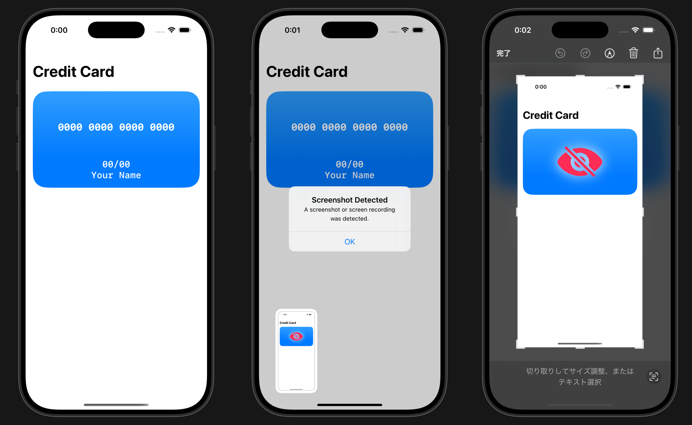

# SwiftUI-ContentCaptureVisibility

このパッケージは、SwiftUIで画面キャプチャ（スクリーンショットや画面録画）から特定のビューを保護するための仕組みを提供します。
TestコードにはPrivate APIが使用されていますが、**本番コードには一切使用されていません。**

### 機能
`.contentCaptureVisibility` を使って、Viewの表示を以下のように制御可能：
-	`normal`：通常通り表示
-	`hiddenOnCapture`：スクリーンショットや録画時に非表示
- `visibleOnlyOnCapture`：スクリーンショットや録画時のみ表示

### サンプル実装
[ExamplesフォルダのContentView](Examples/ContentView.swift) にサンプルがあります。

## インストール
Swift Package Manager (SPM) を使用してインストールできます。

1. Xcode でプロジェクトを開きます。
1. **File > Add Package Dependency...** を選択します。
1. `https://github.com/Chronos2500/SwiftUI-ContentCaptureVisibility.git` を入力します。
1. バージョン指定ルール等を設定し、**Add Package** をクリックします。

## ライセンス
MIT ライセンスのもとで提供されます。

Chronos2500 © 2025
